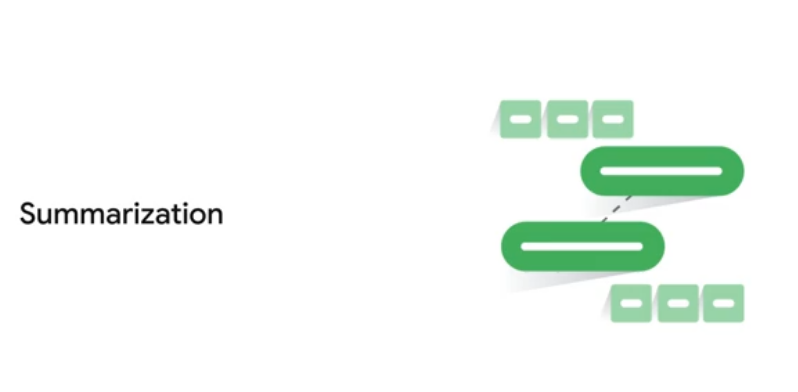

Looking at this Agent Assist quiz, I'll provide answers based on Google Cloud's Agent Assist features:

**1. Each conversation can have the following participants:**
- ✓ End-user
- ✓ Automated agent  
- ✓ Human agent
(Conversational profile is a configuration, not a participant)

**2. True or False: With Agent Assist, agents can handle more queries more efficiently, thereby reducing overall cost.**
**True** - Agent Assist improves efficiency by providing real-time suggestions and assistance, reducing handle times and operational costs.

**3. What is the purpose of Conversation Profiles in Agent Assist?**
**To control suggestions provided to human agents** - Conversation Profiles configure how Agent Assist behaves and what suggestions it provides.

**4. Which of these is an Agent Assist feature?**
**Smart Reply** - This feature provides suggested responses to help agents reply more efficiently.

**5. True or False: Regionalization provides data residency to keep a customer's data-at-rest physically within a specified geographical region or location.**
**True** - Regionalization ensures data stays within specific geographic boundaries for compliance and regulatory requirements.

**6. Which Agent Assist feature provides a real-time written record of dialogue between customers and human agents?**
**Live Transcription** - This feature converts spoken conversations into real-time text transcripts.

**7. True or False: A conversation with an end-user consists of multiple stages.**
**True** - Conversations typically include stages like initiation, active dialogue, problem resolution, and closure.

**8. What is the primary vision of Agent Assist?**
**To provide agents with suggestions and summaries to user questions** - Agent Assist augments human agents rather than replacing them.

**9. Which Agent Assist feature is designed to improve an agent's post-call average handle time?**
**Summarization** - Automatically generates conversation summaries, reducing the time agents spend on post-call documentation.

**10. Which two metrics represent the sentiment of a conversation?**
- ✓ **Magnitude** (strength/intensity of sentiment)
- ✓ **Score** (positive/negative sentiment direction)

