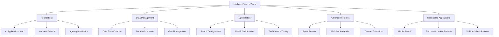
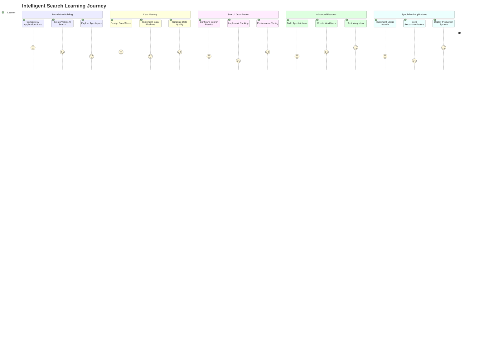
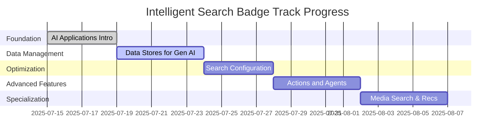

# 🔍 Intelligent Search - Technical Expert Badge Track

[](https://rsvp.withgoogle.com/events/partner-learning/intelligent-search)
[](https://cloud.google.com/vertex-ai)
[](https://cloud.google.com/ai)

> **Master the art of building sophisticated search experiences with AI-powered capabilities**

Transform your search and recommendation systems using Google Cloud's cutting-edge AI technologies. This comprehensive learning track will guide you through building intelligent search applications, managing data stores, optimizing search results, and creating powerful recommendation engines.

## 📋 Table of Contents

- [🎯 Track Overview](#-track-overview)
- [🏗️ Learning Architecture](#️-learning-architecture)
- [📚 Learning Paths](#-learning-paths)
- [🛤️ Learning Journey](#️-learning-journey)
- [⏱️ Time Investment](#️-time-investment)
- [🎯 Prerequisites](#-prerequisites)
- [🚀 Getting Started](#-getting-started)
- [📊 Progress Tracking](#-progress-tracking)
- [🏆 Skill Badges](#-skill-badges)
- [📖 Additional Resources](#-additional-resources)

## 🎯 Track Overview

The Intelligent Search Technical Expert Badge track focuses on building next-generation search and recommendation systems using Google Cloud's AI Applications, Vertex AI Search, and Agentspace technologies.

### 🎯 What You'll Learn
- **AI-Powered Search**: Build intelligent search applications with natural language processing
- **Data Management**: Create and maintain robust data stores for Gen AI applications
- **Search Optimization**: Configure and fine-tune search results for optimal user experience
- **Agent Integration**: Extend search capabilities with intelligent agents and actions
- **Media Intelligence**: Implement advanced media search and recommendation systems

### 🎯 Who This Is For
- **Search Engineers** looking to modernize their search infrastructure
- **Data Scientists** interested in building recommendation systems
- **Solution Architects** designing AI-powered search solutions
- **Product Managers** overseeing search and discovery features
- **ML Engineers** implementing production search systems

## 🏗️ Learning Architecture



## 📚 Learning Paths

### 🌟 Path 1: Intro to AI Applications, Vertex AI Search, and Agentspace
**🔗 [Enroll in Learning Path](https://partner.cloudskillsboost.google/paths/2304)**

Build the foundation for intelligent search applications using Google Cloud's AI technologies.

**📊 What You'll Master:**
- Fundamentals of AI Applications for search
- Vertex AI Search capabilities and setup
- Agentspace platform overview
- Basic search application architecture

**🏆 Skill Badge Earned:** *Build search and recommendations applications with AI Applications*

---

### 🗄️ Path 2: Data Stores for Gen AI Apps
**🔗 [Enroll in Learning Path](https://partner.cloudskillsboost.google/paths/2305)**

Learn to create and maintain robust data stores optimized for generative AI applications.

**📊 What You'll Master:**
- Data store design patterns for AI applications
- Vertex AI Search data store creation
- Data ingestion and preprocessing
- Schema design and optimization
- Data quality and governance

**🏆 Skill Badge Earned:** *Create and maintain Vertex AI Search data stores*

---

### ⚙️ Path 3: Configuring and Improving Search Results
**🔗 [Enroll in Learning Path](https://partner.cloudskillsboost.google/paths/2302)**

Optimize search performance and relevance through advanced configuration techniques.

**📊 What You'll Master:**
- Search result ranking algorithms
- Query understanding and expansion
- Faceting and filtering strategies
- Performance optimization techniques
- A/B testing for search improvements

**🏆 Skill Badge Earned:** *Configure AI Applications to optimize search results*

---

### 🎭 Path 4: Actions and Agents in Agentspace
**🔗 [Enroll in Learning Path](https://partner.cloudskillsboost.google/paths/2299)**

Extend your search applications with intelligent agents and automated actions.

**📊 What You'll Master:**
- Agentspace platform deep dive
- Creating custom actions and workflows
- Agent integration patterns
- Conversational search interfaces
- Multi-turn interaction design

**🏆 Skill Badge Earned:** *Extend Agentspace assistant capabilities*

---

### 🎬 Path 5: Media Search and Recommendations
**🔗 [Enroll in Learning Path](https://partner.cloudskillsboost.google/paths/2300)**

Build sophisticated media search and recommendation systems for rich content discovery.

**📊 What You'll Master:**
- Multimodal search capabilities
- Video and image content analysis
- Personalized recommendation algorithms
- Content similarity and clustering
- Real-time recommendation serving

**🏆 Skill Badge Earned:** *Create media search and media recommendations applications with AI Applications*

## 🛤️ Learning Journey



## ⏱️ Time Investment

| Learning Path | Estimated Time | Difficulty | Hands-on Labs |
|---------------|----------------|------------|---------------|
| 🌟 AI Applications Intro | 3-4 hours | Beginner | 2-3 labs |
| 🗄️ Data Stores for Gen AI | 4-5 hours | Intermediate | 3-4 labs |
| ⚙️ Search Configuration | 3-4 hours | Intermediate | 2-3 labs |
| 🎭 Actions and Agents | 4-5 hours | Advanced | 3-4 labs |
| 🎬 Media Search & Recommendations | 4-5 hours | Advanced | 3-4 labs |

**📅 Total Time Investment:** 18-23 hours
**🎯 Recommended Pace:** 1-2 paths per week
**⏰ Challenge Completion:** 3-4 weeks

## 🎯 Prerequisites

### ✅ Required Knowledge
- **Google Cloud Platform basics**
- **REST API concepts**
- **JSON and data structures**
- **Basic understanding of search concepts**

### 🎓 Recommended Background
- **Machine Learning fundamentals**
- **Data engineering concepts**
- **Web application development**
- **Database design principles**

### 📚 Preparation Resources
- [Google Cloud Fundamentals](https://cloud.google.com/training/courses#cloud-fundamentals)
- [Introduction to APIs](https://cloud.google.com/apis/design)
- [Machine Learning Crash Course](https://developers.google.com/machine-learning/crash-course)

## 🚀 Getting Started

### Step 1: Environment Setup
```bash
# Set up your Google Cloud environment
gcloud auth login
gcloud config set project YOUR_PROJECT_ID

# Enable required APIs
gcloud services enable aiplatform.googleapis.com
gcloud services enable discoveryengine.googleapis.com
```

### Step 2: Start with Foundation
Begin with **Path 1: AI Applications Intro** to build your foundational understanding.

### Step 3: Follow Sequential Learning
Complete paths in the recommended order for optimal learning progression.

### Step 4: Hands-on Practice
Utilize the provided labs and create your own practice projects.

## 📊 Progress Tracking

### 🏁 Learning Path Completion Checklist

#### 🌟 AI Applications, Vertex AI Search, and Agentspace
- [ ] **Module 1:** Introduction to AI Applications
- [ ] **Module 2:** Vertex AI Search Overview
- [ ] **Module 3:** Agentspace Platform Basics
- [ ] **Lab 1:** Create Your First Search Application
- [ ] **Lab 2:** Implement Basic Search Functionality
- [ ] **Challenge Lab:** Build End-to-End Search Solution
- [ ] **🏆 Badge:** Build search and recommendations applications with AI Applications

#### 🗄️ Data Stores for Gen AI Apps
- [ ] **Module 1:** Data Store Architecture
- [ ] **Module 2:** Creating Vertex AI Search Data Stores
- [ ] **Module 3:** Data Ingestion Strategies
- [ ] **Lab 1:** Set Up Data Store Infrastructure
- [ ] **Lab 2:** Implement Data Pipelines
- [ ] **Lab 3:** Optimize Data Quality
- [ ] **Challenge Lab:** Production Data Store Deployment
- [ ] **🏆 Badge:** Create and maintain Vertex AI Search data stores

#### ⚙️ Configuring and Improving Search Results
- [ ] **Module 1:** Search Configuration Fundamentals
- [ ] **Module 2:** Ranking and Relevance
- [ ] **Module 3:** Performance Optimization
- [ ] **Lab 1:** Configure Search Parameters
- [ ] **Lab 2:** Implement Custom Ranking
- [ ] **Challenge Lab:** Optimize Search Performance
- [ ] **🏆 Badge:** Configure AI Applications to optimize search results

#### 🎭 Actions and Agents in Agentspace
- [ ] **Module 1:** Agentspace Deep Dive
- [ ] **Module 2:** Creating Custom Actions
- [ ] **Module 3:** Workflow Integration
- [ ] **Lab 1:** Build Agent Actions
- [ ] **Lab 2:** Implement Workflows
- [ ] **Lab 3:** Test Agent Integration
- [ ] **Challenge Lab:** Production Agent Deployment
- [ ] **🏆 Badge:** Extend Agentspace assistant capabilities

#### 🎬 Media Search and Recommendations
- [ ] **Module 1:** Multimodal Search Concepts
- [ ] **Module 2:** Media Content Analysis
- [ ] **Module 3:** Recommendation Algorithms
- [ ] **Lab 1:** Implement Media Search
- [ ] **Lab 2:** Build Recommendation Engine
- [ ] **Lab 3:** Optimize Performance
- [ ] **Challenge Lab:** Production Media Search System
- [ ] **🏆 Badge:** Create media search and media recommendations applications

### 📈 Overall Track Progress


## 🏆 Skill Badges

Upon completion of each learning path, you'll earn the following skill badges:

| Badge | Learning Path | Skills Validated |
|-------|---------------|------------------|
| 🔍 **Search & Recommendations Builder** | AI Applications Intro | Search application development, basic AI integration |
| 🗄️ **Data Store Specialist** | Data Stores for Gen AI | Data architecture, Vertex AI Search setup, data quality |
| ⚙️ **Search Optimization Expert** | Search Configuration | Performance tuning, ranking algorithms, result optimization |
| 🎭 **Agentspace Developer** | Actions and Agents | Agent development, workflow creation, conversational interfaces |
| 🎬 **Media Intelligence Architect** | Media Search & Recommendations | Multimodal search, recommendation systems, content analysis |

## 📖 Additional Resources

### 🔧 Tools and Platforms
- **[Google Cloud Console](https://console.cloud.google.com/)**
- **[Vertex AI Platform](https://cloud.google.com/vertex-ai)**
- **[Discovery Engine](https://cloud.google.com/discovery-engine)**
- **[Agentspace Platform](https://cloud.google.com/agentspace)**

### 📚 Documentation
- **[Vertex AI Search Documentation](https://cloud.google.com/vertex-ai-search/docs)**
- **[AI Applications Guide](https://cloud.google.com/ai-applications)**
- **[Agentspace Documentation](https://cloud.google.com/agentspace/docs)**
- **[Best Practices Guide](https://cloud.google.com/architecture/ai-ml)**

### 🎓 Advanced Learning
- **[Machine Learning Engineering](https://cloud.google.com/training/machinelearning-ai)**
- **[Data Engineering Courses](https://cloud.google.com/training/data-ml)**
- **[AI/ML Specialization](https://cloud.google.com/training/courses#ai-and-ml)**

### 🤝 Community
- **[Google Cloud Community](https://www.googlecloudcommunity.com/)**
- **[AI/ML Discussion Forums](https://stackoverflow.com/questions/tagged/google-cloud-platform)**
- **[YouTube - Google Cloud Tech](https://www.youtube.com/GoogleCloudTech)**

---

## 🎯 Quick Start Commands

```bash
# Clone the repository for resources
git clone https://github.com/Yash-Kavaiya/Gen-AI-Technical-Expert.git
cd Gen-AI-Technical-Expert/Intelligent\ Search/

# Set up your environment
export PROJECT_ID="your-project-id"
export REGION="us-central1"

# Begin your first learning path
echo "🚀 Starting Intelligent Search journey!"
echo "📚 Begin with: AI Applications, Vertex AI Search, and Agentspace"
echo "🔗 Enroll at: https://partner.cloudskillsboost.google/paths/2304"
```

---

**💡 Success Tip**: Focus on hands-on practice with each concept before moving to the next learning path. The challenge labs are designed to test real-world application of your knowledge!

**⏰ Remember**: Complete all learning paths within the challenge period (July 15 - August 15, 2025) to be eligible for the Technical Expert Badge and early adopter rewards.

---
*Last updated: July 17, 2025*

**🔗 Quick Navigation:**
- [← Back to Main Challenge](../)
- [🤖 Customer Engagement Suite](../Customer%20Engagement%20Suite%20with%20Google%20AI/)
- [🧠 Build with Vertex AI](../Build%20with%20Vertex%20AI/)