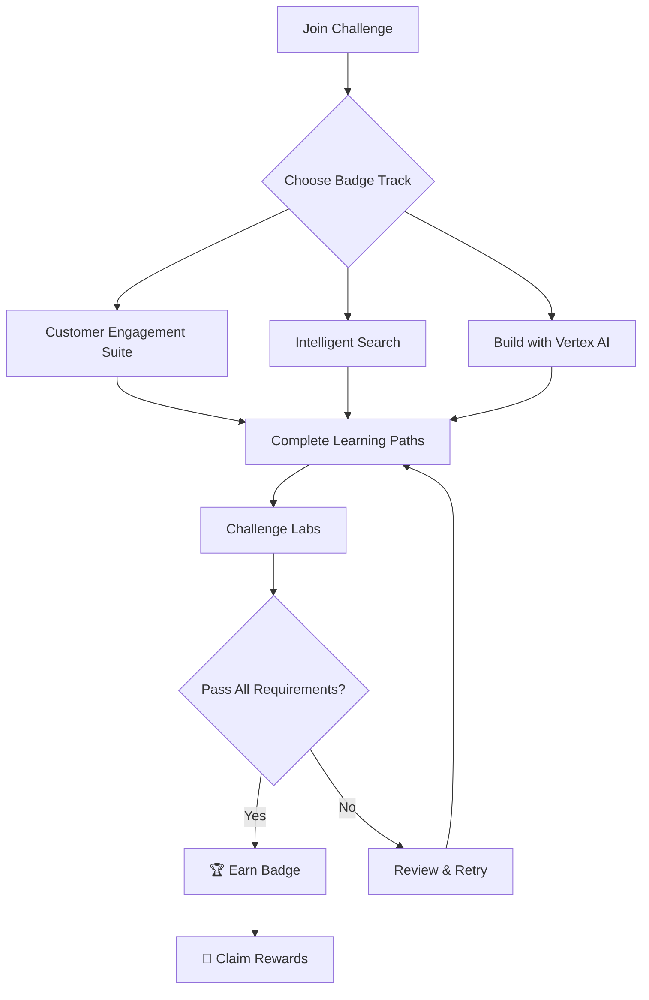
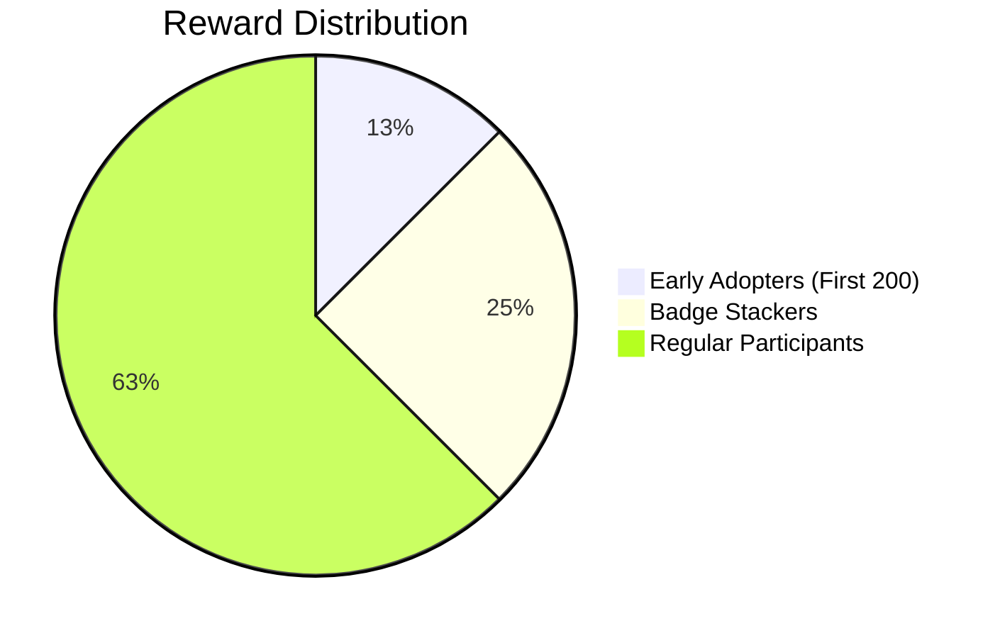
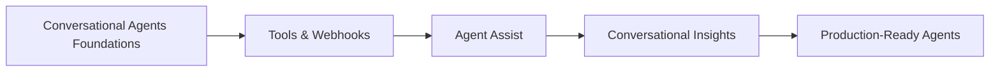
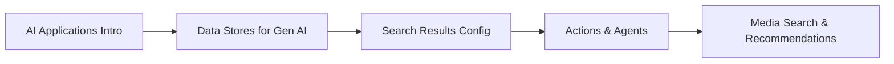
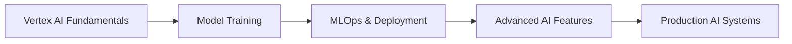
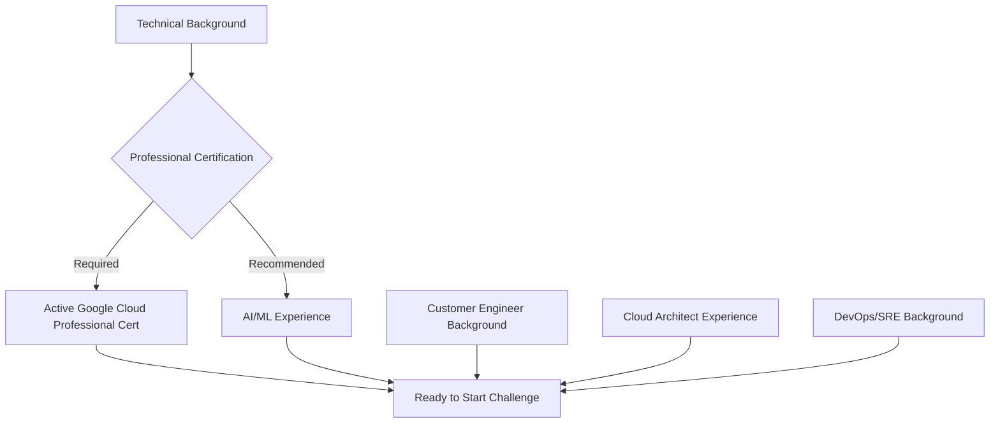
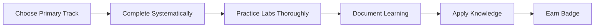
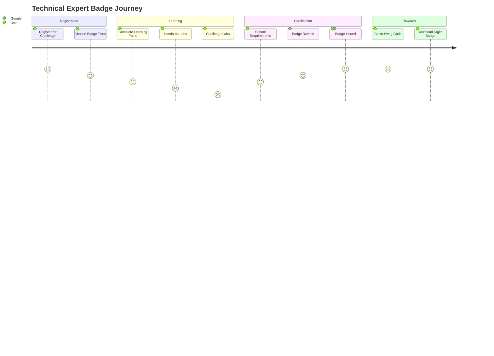

# 🚀 Gen AI Technical Expert Badge Challenge - Early Adopter Edition

[](https://cloud.google.com)
[](https://www.tensorflow.org)
[](https://cloud.google.com/vertex-ai)
[](https://rsvp.withgoogle.com/events/skill-badge-challenge/expert-edition)
[](https://rsvp.withgoogle.com/events/skill-badge-challenge/expert-edition)
[](https://rsvp.withgoogle.com/events/skill-badge-challenge/expert-edition)

> **Ready to boost your technical expertise and snag some awesome Google swag?**

Welcome to the Gen AI Technical Expert Badge Challenge! This repository contains resources and information for earning one of three prestigious Technical Expert Badges between **July 15 and August 15, 2025**.

## 📋 Table of Contents

- [🎯 Challenge Overview](#-challenge-overview)
- [🏆 Rewards & Recognition](#-rewards--recognition)
- [📚 Available Badge Tracks](#-available-badge-tracks)
- [🛤️ Learning Paths](#️-learning-paths)
- [📋 Prerequisites](#-prerequisites)
- [🚀 Getting Started](#-getting-started)
- [📊 Progress Tracking](#-progress-tracking)
- [� Tips for Success](#-tips-for-success)
- [�📞 Support & Community](#-support--community)
- [📖 Additional Resources](#-additional-resources)
- [🎖️ Badge Journey](#️-badge-journey)

## 🎯 Challenge Overview



The Gen AI Technical Expert Badge Challenge is designed for technical professionals who want to:
- **Deepen their Gen AI knowledge** with hands-on experience
- **Stay current** with evolving Google Cloud AI technologies
- **Validate their skills** through practical challenges
- **Join an exclusive community** of early adopters

### 🗓️ Challenge Timeline
- **Start Date:** July 15, 2025
- **End Date:** August 15, 2025
- **Duration:** 1 month intensive learning

## 🏆 Rewards & Recognition

> 🚀 **Limited Time**: First 200 badge earners per track get exclusive rewards!



### 🎁 For First 200 Badge Earners
If you're among the **first 200** to earn a Technical Expert Badge, you'll receive:

- 💰 **$50 USD Google Swag Redemption Code**
- 🏅 **Exclusive "Early Adopter" Digital Swag**
- 🎯 **Priority Access** to future Google Cloud programs
- 📜 **Digital Certificate** with unique verification ID

### 📈 Stack Your Badges, Stack Your Swag!
Earn **multiple Technical Expert Badges** and get rewards for each one (limited to first 200 per badge):
- **Total potential winners:** 600 across all badges
- **Maximum rewards per person:** Up to $150 USD + 3 digital badges
- **Completion timeline:** Each badge can be earned independently

### 🏅 Recognition Benefits
Beyond monetary rewards, badge earners receive:
- **LinkedIn Badge Integration**: Showcase your expertise
- **Google Cloud Community Recognition**: Join elite early adopters
- **Resume Enhancement**: Validate cutting-edge AI skills
- **Network Access**: Connect with fellow badge earners

## 📚 Available Badge Tracks

### 🤖 Customer Engagement Suite with Google AI
Build intelligent customer service solutions using Google's conversational AI technologies.

**🔗 [Enroll Now](https://rsvp.withgoogle.com/events/partner-learning/ces)**



### 🔍 Intelligent Search
Master the art of building sophisticated search experiences with AI-powered capabilities.

**🔗 [Enroll Now](https://rsvp.withgoogle.com/events/partner-learning/intelligent-search)**



### 🧠 Build with Vertex AI
Create powerful AI applications leveraging Google Cloud's unified ML platform.

**🔗 [Enroll Now](https://rsvp.withgoogle.com/events/partner-learning/build-with-vertex-ai)**



## 🛤️ Learning Paths

Each badge track consists of multiple learning paths with hands-on labs:

### Customer Engagement Suite Detailed Path
| Learning Path | Skill Badge Earned | Estimated Time |
|---------------|-------------------|----------------|
| 🏗️ [Conversational Agents Foundations](./Customer%20Engagement%20Suite%20with%20Google%20AI/) | Build basic Conversational Agents with Playbooks and Flows | 4-6 hours |
| 🔧 [Tools and Webhooks](./Customer%20Engagement%20Suite%20with%20Google%20AI/) | Extend virtual agents with webhooks, tools, and messenger integration | 3-5 hours |
| 🤝 [Agent Assist](./Customer%20Engagement%20Suite%20with%20Google%20AI/) | Improve customer and agent satisfaction with Agent Assist | 3-4 hours |
| 📊 [Conversational Insights](./Customer%20Engagement%20Suite%20with%20Google%20AI/) | Analyze patterns in conversational data | 2-3 hours |
| 🚀 [Production-Ready Agents](./Customer%20Engagement%20Suite%20with%20Google%20AI/) | Deploy enterprise-grade conversational solutions | 4-6 hours |

### Intelligent Search Detailed Path
| Learning Path | Skill Badge Earned | Estimated Time |
|---------------|-------------------|----------------|
| 🌟 [AI Applications Intro](./Intelligent%20Search/) | Build search and recommendations applications with AI Applications | 3-4 hours |
| 🗄️ [Data Stores for Gen AI Apps](./Intelligent%20Search/) | Create and maintain Vertex AI Search data stores | 3-5 hours |
| ⚙️ [Search Results Configuration](./Intelligent%20Search/) | Configure AI Applications to optimize search results | 3-4 hours |
| 🎭 [Actions and Agents in Agentspace](./Intelligent%20Search/) | Extend Agentspace assistant capabilities | 4-5 hours |
| 🎬 [Media Search and Recommendations](./Intelligent%20Search/) | Create media search and media recommendations applications | 3-4 hours |

### Build with Vertex AI Detailed Path
| Learning Path | Skill Badge Earned | Estimated Time |
|---------------|-------------------|----------------|
| 🏗️ [Vertex AI Foundations](./Build%20with%20Vertex%20AI/) | Build search and recommendations applications with AI Applications | 4-6 hours |
| 💾 [Data Management](./Build%20with%20Vertex%20AI/) | Create and maintain Vertex AI Search data stores | 3-5 hours |
| 🔧 [Model Configuration](./Build%20with%20Vertex%20AI/) | Configure AI Applications to optimize search results | 4-5 hours |
| 🤖 [Advanced AI Features](./Build%20with%20Vertex%20AI/) | Extend Agentspace assistant capabilities | 5-6 hours |
| 🎥 [Production AI Systems](./Build%20with%20Vertex%20AI/) | Create media search and media recommendations applications | 4-6 hours |

## 📋 Prerequisites



### ✅ Required
- **Active Google Cloud Professional Certification** (any of the following):
  - Professional Cloud Architect
  - Professional Data Engineer
  - Professional Cloud Developer
  - Professional Cloud DevOps Engineer
  - Professional Cloud Security Engineer
  - Professional Cloud Database Engineer
  - Professional Cloud Network Engineer
  - Professional Machine Learning Engineer

### 🎯 Recommended Background
- **Technical professionals** such as:
  - Customer Engineers
  - Solutions Architects
  - DevOps Engineers
  - Data Scientists
  - ML Engineers
- **Prerequisite knowledge:**
  - Google Cloud Platform fundamentals
  - Basic understanding of AI/ML concepts
  - Command-line interface experience
  - API integration experience

### 📚 Preparation Resources
- [Google Cloud Skills Boost](https://www.cloudskillsboost.google/)
- [Google Cloud Documentation](https://cloud.google.com/docs)
- [Vertex AI Documentation](https://cloud.google.com/vertex-ai/docs)

## 🚀 Getting Started

### Step 1: Register for the Challenge
**🔗 [Register Here](https://rsvp.withgoogle.com/events/skill-badge-challenge/expert-edition)**

### Step 2: Choose Your Badge Track(s)
Select one or more tracks based on your interests and career goals:

```bash
# Clone this repository for resources
git clone https://github.com/Yash-Kavaiya/Gen-AI-Technical-Expert.git
cd Gen-AI-Technical-Expert
```

### Step 3: Complete Learning Paths
Follow the structured learning paths in your chosen track(s).

### Step 4: Complete Challenge Labs
Each learning path concludes with a hands-on challenge lab.

### Step 5: Earn Your Badge(s)
Successfully complete all requirements to earn your Technical Expert Badge.

## 📊 Progress Tracking

Track your progress using this checklist:

### Customer Engagement Suite Progress
- [ ] Conversational Agents Foundations
- [ ] Conversational Agents Tools and Webhooks  
- [ ] Agent Assist
- [ ] Conversational Insights
- [ ] Production-Ready Conversational Agents

### Intelligent Search Progress
- [ ] Intro to AI Applications, Vertex AI Search, and Agentspace
- [ ] Data Stores for Gen AI Apps
- [ ] Configuring and Improving Search Results
- [ ] Actions and Agents in Agentspace
- [ ] Media Search and Recommendations

### Build with Vertex AI Progress
- [ ] Intro to AI Applications, Vertex AI Search, and Agentspace
- [ ] Data Stores for Gen AI Apps
- [ ] Configuring and Improving Search Results
- [ ] Actions and Agents in Agentspace
- [ ] Media Search and Recommendations

## � Tips for Success

### 🎯 Strategic Approach


- **Start with your strongest area**: Choose the track that aligns with your current expertise
- **Block dedicated time**: Set aside 2-3 hours per day for focused learning
- **Hands-on practice**: Don't skip the labs - they're crucial for retention
- **Take notes**: Document key concepts and code snippets for future reference
- **Join study groups**: Connect with other participants for motivation and support

### ⚡ Time Management
- **Week 1**: Complete 1-2 learning paths
- **Week 2**: Focus on challenge labs and practical application
- **Week 3**: Complete remaining paths and review concepts
- **Week 4**: Final badge completion and start additional tracks

### 🔧 Technical Preparation
- Ensure you have a **Google Cloud account** with billing enabled
- Familiarize yourself with **Google Cloud Console** navigation
- Review **API documentation** for relevant services
- Set up your **development environment** early

### 📚 Learning Best Practices
- **Read documentation first**: Understand concepts before diving into labs
- **Experiment freely**: Use the free tier and credits to explore
- **Ask questions**: Utilize community forums and support channels
- **Share knowledge**: Teaching others reinforces your own learning

## �📞 Support & Community

### 🤝 Community Resources
- **Google Cloud Community**: [Join discussions](https://www.googlecloudcommunity.com/)
- **Stack Overflow**: Tag your questions with `google-cloud-platform`
- **Discord**: Join the Google Cloud community server

### 📧 Official Support
- **Challenge Support**: Contact through the registration portal
- **Technical Issues**: Use Google Cloud Support (for certified professionals)

### 📖 Documentation
- [Google Cloud Skills Boost](https://www.cloudskillsboost.google/)
- [Technical Expert Badge Details](https://rsvp.withgoogle.com/events/skill-badge-challenge/expert-edition)

## 📖 Additional Resources

### 📚 Official Documentation
- [Google Cloud AI Platform](https://cloud.google.com/ai-platform)
- [Vertex AI Documentation](https://cloud.google.com/vertex-ai/docs)
- [Dialogflow CX](https://cloud.google.com/dialogflow/cx/docs)
- [Discovery Engine](https://cloud.google.com/discovery-engine/docs)

### 🎥 Video Learning
- [Google Cloud Tech YouTube Channel](https://www.youtube.com/c/GoogleCloudTech)
- [AI/ML Playlist](https://www.youtube.com/playlist?list=PLIivdWyY5sqJxnwJhe3etaK7utrBiPBQ2)
- [Vertex AI Demos](https://www.youtube.com/playlist?list=PLIivdWyY5sqK5SM34zbkitWLOV-b3V40B)

### 📖 Reading Materials
- [Google Cloud AI Blog](https://cloud.google.com/blog/products/ai-machine-learning)
- [Towards Data Science](https://towardsdatascience.com/)
- [Google Research Papers](https://research.google/pubs/)

### 🛠️ Development Tools
- [Google Cloud CLI](https://cloud.google.com/sdk/gcloud)
- [Cloud Shell](https://cloud.google.com/shell)
- [Vertex AI Workbench](https://cloud.google.com/vertex-ai-workbench)
- [Cloud Code](https://cloud.google.com/code)

### 💻 Sample Code & Templates
- [Google Cloud Samples](https://github.com/GoogleCloudPlatform)
- [Vertex AI Samples](https://github.com/GoogleCloudPlatform/vertex-ai-samples)
- [Dialogflow Samples](https://github.com/GoogleCloudPlatform/dialogflow-samples)

---

## 🎖️ Badge Journey Flow



---

## 🎖️ Badge Journey Flow


---

## 🌟 Success Stories

> "The Gen AI Technical Expert Badge Challenge transformed my understanding of AI applications. The hands-on labs were incredibly valuable!" - *Previous Badge Earner*

> "Earning multiple badges not only boosted my technical skills but also opened new career opportunities." - *Early Adopter*

---

## 📈 Challenge Statistics

| Metric | Value |
|--------|-------|
| 🎯 Total Badges Available | 3 |
| 💰 Total Reward Pool | $30,000 USD |
| ⏰ Challenge Duration | 31 Days |
| 🏆 Early Adopter Spots | 600 Total |
| 📚 Learning Paths | 15+ |
| 🧪 Hands-on Labs | 50+ |

---

**💡 Pro Tip**: Start with the track that aligns most closely with your current role, then expand to other tracks to maximize your learning and rewards!

**⏰ Remember**: This is a time-limited challenge. The first 200 earners per badge get the exclusive rewards, so start your learning journey today!

**🚀 Ready to Begin?** Click the registration link and choose your first badge track!

---

<div align="center">

### 📞 Have Questions?

[](https://discord.gg/googlecloud)
[](https://stackoverflow.com/questions/tagged/google-cloud-platform)
[](https://www.googlecloudcommunity.com/)

</div>

---

*Last updated: July 17, 2025 | Repository maintained by [Yash Kavaiya](https://github.com/Yash-Kavaiya)*

**🔗 Quick Links:**
- [🚀 Main Challenge Page](https://rsvp.withgoogle.com/events/skill-badge-challenge/expert-edition)
- [🤖 Customer Engagement Suite](https://rsvp.withgoogle.com/events/partner-learning/ces)
- [🔍 Intelligent Search](https://rsvp.withgoogle.com/events/partner-learning/intelligent-search)  
- [🧠 Build with Vertex AI](https://rsvp.withgoogle.com/events/partner-learning/build-with-vertex-ai)

<div align="center">
  
[](https://github.com/Yash-Kavaiya/Gen-AI-Technical-Expert)
[](https://github.com/Yash-Kavaiya/Gen-AI-Technical-Expert/fork)
[](https://github.com/Yash-Kavaiya)

**Made with ❤️ for the Google Cloud AI Community**

</div> 